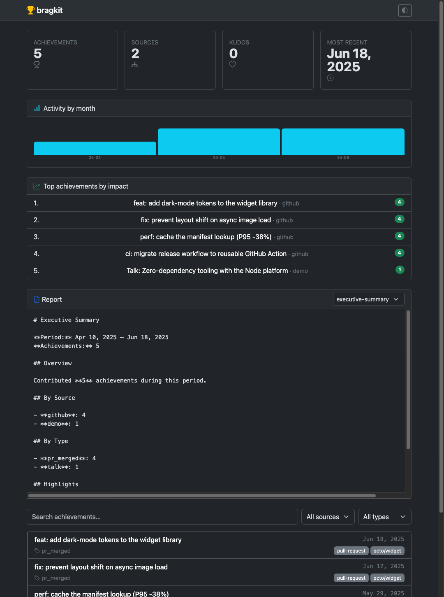

# bragkit

**Track your professional achievements — collect, store, and report.**

bragkit pulls your work — merged GitHub PRs, resolved Jira issues, Confluence
pages, and high-signal Slack moments — into a local SQLite database and turns it
into markdown reports and a browsable dashboard, so when review, promotion, or
résumé season arrives, your wins are already written down.



> The screenshot above uses bragkit's bundled **sample data** — not real activity.

## Why it's tiny

It's written in **TypeScript and run directly by Node** (type-stripping) — no
build, no bundler, no `dist/`. The core has **zero runtime dependencies**,
running entirely on the modern Node platform:

| Job | bragkit uses | instead of |
|-----|--------------|-----------|
| Language | TypeScript, run natively (`node bin/brag.ts`) | a build step / `tsc` emit |
| Storage | `node:sqlite` | `better-sqlite3` (native compile) |
| CLI args | `node:util` `parseArgs` | `commander` / `yargs` |
| Tests | `node:test` | `jest` / `vitest` |
| GitHub auth | the `gh` CLI you already have | OAuth apps / PATs |

`npm install` pulls nothing for the core — no native build step, no
supply-chain surface. Dev dependencies are dev-only: [vite-plus](https://www.npmjs.com/package/vite-plus)
(dashboard dev/build) and `typescript` + `@types/node` (type-checking). The
dashboard's CSS (Bootstrap) loads from a CDN, so it isn't an npm dependency.

> **Requires Node 24+** for native TypeScript execution and a stable `node:sqlite`.

## Quick start

```bash
# 1. Collect your merged PRs (uses your existing `gh` login — no token setup)
node bin/brag.ts collect --since "90 days ago"

# 2. Generate a report
node bin/brag.ts report "Q2 2025" --template executive-summary

# 3. Browse them
node bin/brag.ts export              # writes web/public/achievements.json
npm run web:dev                      # open the dashboard
```

## CLI

```
brag collect [--source a,b] [--since <date>] [--until <date>] [--enrich]
             [--github-repos o/r,o/r2] [--jira-projects K1,K2]
             [--confluence-spaces S1,S2] [--slack-channels c1,c2] [--db <path>] [--json]
brag report  <period> [--template <name>] [--format markdown|json] [--out <file>]
brag export  [--out web/public/achievements.json]
brag list    [--limit <n>]
brag config                       Show which collectors are configured & ready
brag runs    [--limit <n>]        Show the collection-run audit trail
```

- **Dates:** `2025-06-01`, `"30 days ago"`, `today`.
- **Period:** `2025`, `Q1 2025`, `2025-01-01 to 2025-06-30`, or a single date.
- **Default DB:** `~/.local/share/bragkit/bragkit.db`.
- `--source` takes one or more comma-separated names; omit it to run every collector.
- `--enrich` (GitHub) fetches per-PR lines/files/commits/reviews via GraphQL — accurate but one API call per PR.
- `--github-repos` / `--jira-projects` / `--confluence-spaces` / `--slack-channels` scope a collection.

## Collectors & configuration

Run `brag config` to see what's ready. Each collector uses credentials you
likely already have — no app registration required.

| Collector | What it pulls | Configuration |
|-----------|---------------|---------------|
| **github** | your merged PRs and closed issues (opt-in `--enrich` adds lines/files/commits/reviews) | the `gh` CLI (`gh auth login`) — no token needed |
| **jira** | issues you resolved | `ATLASSIAN_SITE`, `ATLASSIAN_EMAIL`, and a token |
| **confluence** | pages & blog posts you created | shares the Jira/Atlassian credentials |
| **slack** | your high-reaction messages + kudos from others | `SLACK_USER_TOKEN` (preferred) or `SLACK_BOT_TOKEN` |

**Atlassian token resolution** (Jira + Confluence) tries, in order:

1. `ATLASSIAN_API_TOKEN` (or `JIRA_API_TOKEN` / `CONFLUENCE_API_TOKEN`) env var, or
2. [1Password](https://developer.1password.com/docs/cli/) — set
   `BRAGKIT_OP_TOKEN_REF` to an `op://…` reference (e.g.
   `op://Private/jira-api-token/credential`) and sign in with `op`.

```bash
export ATLASSIAN_SITE="your-org.atlassian.net"
export ATLASSIAN_EMAIL="you@your-org.com"
export ATLASSIAN_API_TOKEN="…"     # or: export BRAGKIT_OP_TOKEN_REF="op://Private/jira-api-token/credential"
brag collect --source jira --since "Q2 2025 start"
```

## Reports

| Template | Use it for |
|----------|-----------|
| `timeline` | chronological log, grouped by day |
| `by-project` | everything grouped by repo/project, busiest first |
| `executive-summary` | counts by source/type + recent highlights |
| `brag-sheet` | self-advocacy summary for reviews, promo packets, and 1:1s |
| `compensation` | quantified-impact briefing: metrics table (PRs, story points, lines, kudos — per month), impact-ranked highlights, and structured talking points |

`--format json` emits the raw achievement data for any template, for piping into other tools.

> The richest `compensation` numbers come from `collect --enrich` (GitHub code volume) plus Jira (story points) and Slack (kudos).

## Library API

```js
import { Store } from "bragkit/store";
import { github, register, get } from "bragkit";
import { renderReport } from "bragkit/reports";

const store = new Store("./brag.db");
const { achievements } = await github.collect({ since, until });
store.upsertMany(achievements);

const md = renderReport("by-project", store.query({ since, until }), { since, until });
```

## Writing a collector

A collector is one async function. Normalize your source into the
[Achievement](src/achievement.js) shape and you're done — storage and reports
are source-agnostic.

```js
import { register } from "bragkit";

register({
  name: "conference-talks",
  async collect({ since, until }) {
    const achievements = myTalks(since, until).map((t) => ({
      id: `talks:talk:${t.slug}`,
      source: "talks",
      type: "talk",
      title: t.title,
      url: t.url,
      date: t.date,
      tags: ["speaking"],
      metadata: { event: t.event },
    }));
    return { achievements, errors: [] };
  },
});
```

## Dashboard

A single-file vanilla-JS dashboard (Bootstrap + Bootstrap Icons via CDN),
built and served by vite-plus. It reads `web/public/achievements.json` (written
by `brag export`) and falls back to a committed fake sample so it runs out of
the box. Stat cards, an activity-by-month sparkline, impact-ranked top
achievements, an **in-page report viewer** (renders any report template —
timeline, by-project, executive-summary, brag-sheet, compensation, trend — by
importing `reports/markdown.ts` directly), and a searchable/filterable list.
Uses only Baseline web-platform features — no polyfills.

```bash
npm run web:dev      # dev server with HMR
npm run web:build    # static build → web/dist
```

Real exports are git-ignored (they may contain private data); only the fake
`achievements.sample.json` is committed.

## For AI agents

This repo ships agent tooling. Open it in Claude Code and you get:

- **Slash commands:** `/brag-collect`, `/brag-report`, `/brag-compensation`
- **Skill:** `bragkit` (when/how to drive the toolkit)
- **Subagent:** `achievement-curator` for an end-to-end collect → report pass

Contributor guidance — the zero-dependency rule, how to add a collector or
report template, and conventions — is in **[AGENTS.md](AGENTS.md)**. The unbuilt
feature list is in **[BACKLOG.md](BACKLOG.md)**.

## Tests

```bash
npm test             # node --test (runs *.test.ts) — 61 tests, zero deps to install
npm run typecheck    # tsc --noEmit, strict
npm run smoke        # end-to-end CLI smoke check
```

## Publishing

Development needs **no build** — `node bin/brag.ts` runs the source directly.
But Node refuses to type-strip files under `node_modules`, so the **published**
package ships compiled JS: `prepack`/`prepare` run `npm run build`
(`tsconfig.build.json` → `dist/`, rewriting `.ts` import specifiers to `.js`),
and `package.json` `bin`/`exports` point at `dist/`. `npm run pack-smoke`
packs, installs into a throwaway project, and runs the installed `brag` bin to
prove the published artifact works (also a CI job).

## License

MIT © Arturo Silva
